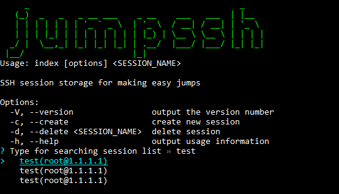

# JumpSSH
## Description
SSH Session storage manager for easy jumps.


## Installation
```bash
npm i -g jumpssh
```
## Usage
```bash
jumpssh <SessionName> [options]
```

#### Options
List and filter all sessions
```bash
jumpssh
```

Directly filter and select session
```bash
jumpssh <SessionName>
```

Create session
```bash
jumpssh -c
```

Delete session
```bash
jumpssh -d
```

Help
```bash
jumpssh -h
```
